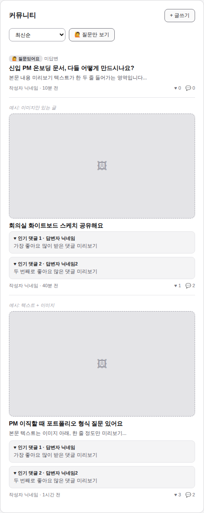
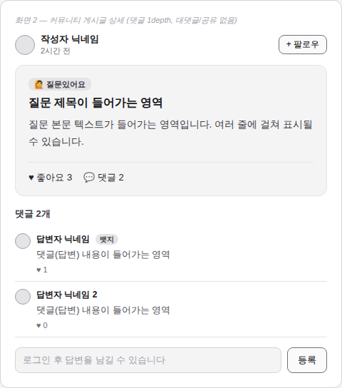
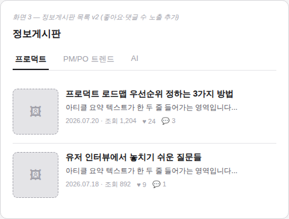
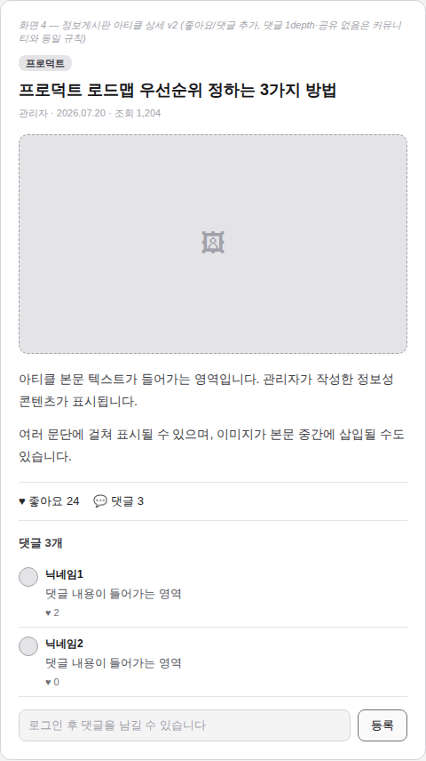
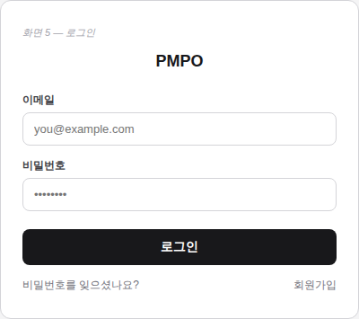
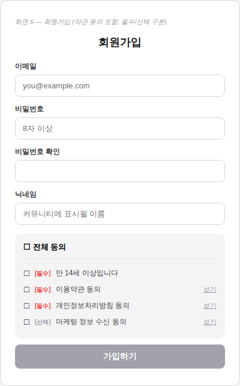
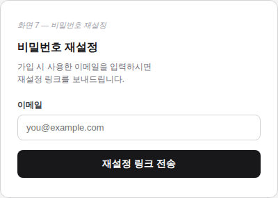
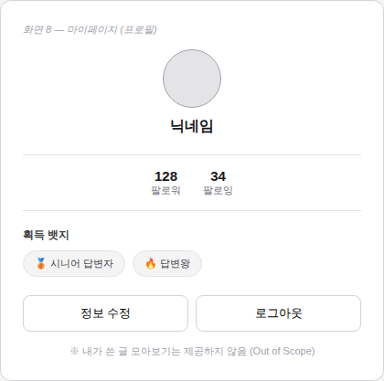
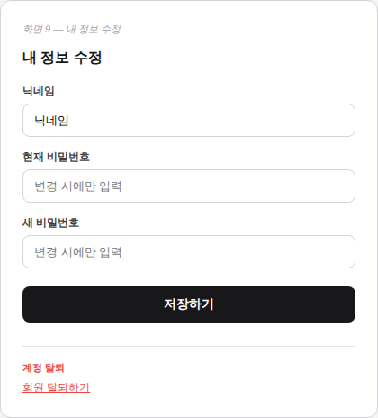
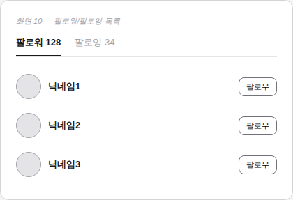

# PMPO 화면설계 (와이어프레임) v0.7

> 이 문서는 IA v0.2 확정 이후 각 화면의 세부 기능 명세를 담습니다.
> 화면이 추가/확정될 때마다 이 문서에 계속 누적합니다.

---

## 화면 1. 커뮤니티 게시글 목록

### 기능 명세

| 요소 | 동작 |
|---|---|
| 정렬 드롭다운 | 최신순(기본) / 답변 없는 질문만 |
| "🙋 질문만 보기" 버튼 | 토글. 켜면 질문 태그된 글만 표시 |
| 카드 클릭 (제목/본문/이미지/인기댓글 영역 전체) | 게시글 상세로 이동 |
| + 글쓰기 버튼 | 비로그인 클릭 시 로그인 페이지로 이동 |
| 페이지네이션 방식 | **무한 스크롤** |
| 인기 댓글 미리보기 | 좋아요 수 기준 상위 **2개** 노출. **카드 타입(텍스트/이미지/텍스트+이미지) 상관없이 동일하게 적용** |

### 카드 타입별 레이아웃 정책

| 콘텐츠 구성 | 표시 방식 |
|---|---|
| 텍스트만 | 본문 일부만 텍스트로 노출 |
| 이미지/영상만 | 이미지 우선 크게 노출, **제목은 필수 입력 강제** (본문 텍스트는 없어도 됨) |
| 텍스트 + 이미지/영상 | 이미지 위, 본문 짧게 아래 |
| (공통) | 인기 댓글 최대 2개는 콘텐츠 타입과 무관하게 항상 동일 위치·형식으로 노출 |

*※ 영상은 현재 PRD 백로그로 미확정. 확정 시 이미지와 동일한 레이아웃 정책 적용 예정.*

### 상태별 화면

- **빈 상태**: 게시글이 하나도 없을 때 → "아직 게시글이 없어요. 첫 질문을 남겨보세요" + 글쓰기 버튼 강조
- **로딩**: 카드 3~5개 스켈레톤
- **에러**: 목록 로드 실패 시 재시도 버튼
- **무한 스크롤 로딩**: 하단에 스피너

### 데이터 소스

- `posts` 테이블 (제목, 본문, 질문태그 여부, 이미지 URL, 작성자, 작성시각)
- 좋아요/댓글 수: count 집계
- 인기 댓글: `comments` 테이블에서 좋아요 수 내림차순 상위 2개
- "미답변" 판정: 질문태그=true AND 댓글수=0

### 우선순위 / 버전

MVP (PRD Must-have 1, 4, 5번 직결) / v0.2

---

## 화면 2. 커뮤니티 게시글 상세

### 기능 명세

| 요소 | 동작 |
|---|---|
| 좋아요 버튼 | 로그인 필요. 클릭 시 즉시 +1, 재클릭 취소. 비로그인 시 로그인 페이지 이동 |
| 팔로우 버튼 | 작성자 프로필/닉네임 영역에 위치. 로그인 필요 |
| 질문 태그 뱃지 | 작성 시 선택한 경우만 노출 |
| 댓글 입력창 | 비로그인 시 비활성화 + 안내 문구 |
| 등록 버튼 | 내용 없으면 비활성화 |
| 댓글 좋아요 | 댓글 1개당 좋아요 가능 |
| 댓글 구조 | **1depth 고정** (대댓글 없음 — PRD Out of Scope) |
| 공유 버튼 | **없음** (PRD Out of Scope) |

### 상태별 화면

- **빈 상태(댓글 0개)**: "아직 답변이 없어요. 첫 답변을 남겨보세요"
- **로딩**: 게시글/댓글 스켈레톤
- **에러**: 게시글이 삭제/존재하지 않을 때 안내 화면

### 데이터 소스

- 게시글: `posts` 테이블
- 댓글: `comments` 테이블 (게시글 id로 필터)
- 좋아요 수: `likes` 테이블 count
- 답변자 뱃지: **팔로우 30명 이상**

### 우선순위 / 버전

MVP (PRD Must-have 1, 3번 직결) / v0.2

---

## 화면 3. 정보게시판 목록

> **설계 결정**: 정보게시판도 커뮤니티와 동일하게 좋아요/댓글 소통 기능을 허용하기로 확정. 관리자만 글을 쓸 수 있다는 점(작성 권한)만 커뮤니티와 다르고, 소비/반응 방식은 동일한 규칙(댓글 1depth, 대댓글·공유 없음)을 재사용.

### 기능 명세

| 요소 | 동작 |
|---|---|
| 카테고리 탭 (프로덕트/PM·PO 트렌드/AI) | 탭 전환 시 해당 카테고리 아티클만 필터링 |
| 아티클 카드 클릭 | 아티클 상세로 이동 |
| 좋아요/댓글 수 | 목록에 노출 |
| 조회수 | 상세 페이지 진입 시 +1. **로그인 유저는 user_id 기준, 비로그인은 브라우저 익명 ID(쿠키) 기준으로 24시간 내 중복 집계 제외** |

### 상태별 화면

- **빈 상태(해당 카테고리에 글 없음)**: "아직 등록된 글이 없어요"
- **로딩**: 카드 스켈레톤
- **에러**: 재시도 버튼

### 데이터 소스

- `articles` 테이블 (제목, 요약, 카테고리, 썸네일, 작성일, 조회수, 좋아요 수, 댓글 수)

### 우선순위 / 버전

MVP (PRD Must-have 2번 직결) / v0.2

---

## 화면 4. 정보게시판 아티클 상세

### 기능 명세

| 요소 | 동작 |
|---|---|
| 본문 | 관리자만 작성 가능 (일반 유저 작성 불가) |
| 조회수 | 목록/상세에 노출, 성공지표 3번(1주일 내 3천뷰)의 측정 기준. 유니크 판별은 화면 3 정책과 동일 |
| 좋아요 | 로그인 필요, 커뮤니티와 동일 규칙 |
| 댓글 | 로그인 필요, 1depth 고정, 대댓글/공유 없음 (커뮤니티와 동일 규칙) |

### 상태별 화면

- **빈 상태(댓글 0개)**: "아직 댓글이 없어요"
- **에러**: 아티클이 삭제/존재하지 않을 때 안내 화면

### 데이터 소스

- `articles` 테이블
- `comments`, `likes` 테이블 (커뮤니티와 동일 테이블 재사용, article_id로 구분)

### 우선순위 / 버전

MVP (PRD Must-have 2번 직결) / v0.2

---

## 화면 5. 로그인

### 기능 명세

| 요소 | 동작 |
|---|---|
| 로그인 버튼 | 이메일/비밀번호 검증 후 Supabase Auth 호출 |
| "회원가입" 링크 | 화면 6으로 이동 |
| "비밀번호를 잊으셨나요?" 링크 | 화면 7로 이동 |

### 상태별 화면

- **에러**: 이메일/비밀번호 불일치 시 인라인 에러 메시지
- **로딩**: 버튼 로딩 스피너

### 데이터 소스

- Supabase Auth

### 우선순위 / 버전

MVP / v0.1

---

## 화면 6. 회원가입

> **제약조건 반영**: PRD 제약조건 4번(이용약관/개인정보처리방침/회원가입 동의 UI)을 여기서 구현. 필수/선택 항목을 명확히 분리했고, **만 14세 이상 확인**을 별도 필수 체크로 넣음.

### 기능 명세

| 요소 | 동작 |
|---|---|
| 전체 동의 체크박스 | 클릭 시 하위 항목 전체 체크/해제 |
| 필수 항목 3개 (만14세 이상 / 이용약관 / 개인정보처리방침) | 전부 체크해야 가입 버튼 활성화 |
| 선택 항목 (마케팅 수신) | 체크 안 해도 가입 가능 |
| "보기" 링크 | 각 약관 전문 페이지/모달로 이동 |
| 가입하기 버튼 | 이메일 중복, 비밀번호 규칙(8자 이상), 닉네임 중복 검증 후 계정 생성 |

### 상태별 화면

- **에러**: 이메일 중복, 비밀번호 규칙 미달, 닉네임 중복 각각 인라인 에러
- **필수 미동의**: 가입 버튼 비활성화(회색) 상태 유지

### 데이터 소스

- Supabase Auth (계정 생성)
- **`user_agreements` 테이블 신설 필요**: 유저별로 어떤 약관에 언제 동의했는지 기록 (법적 근거 보관용 — 단순 체크박스 상태만이 아니라 동의 시각까지 저장)

### 우선순위 / 버전

MVP (PRD 제약조건 4번 직결) / v0.1

---

## 화면 7. 비밀번호 재설정

### 기능 명세

| 요소 | 동작 |
|---|---|
| 이메일 입력 후 전송 | Supabase Auth 비밀번호 재설정 메일 발송 |

### 상태별 화면

- **성공**: "이메일을 확인해주세요" 안내로 전환
- **에러**: 가입되지 않은 이메일일 경우 처리 방식 결정 필요 (보안상 "존재 여부와 무관하게 항상 성공 메시지 표시"가 일반적 — 계정 존재 여부 노출 방지)

### 데이터 소스

- Supabase Auth

### 우선순위 / 버전

MVP / v0.1

---

## 화면 8. 마이페이지 (프로필)

> **설계 결정**: PRD Out of Scope 1번("프로필에서 게시글 모아보기")에 따라, 내가 쓴 글/댓글 목록은 이 화면에 넣지 않음. 팔로워/팔로잉 수, 뱃지만 노출.

### 기능 명세

| 요소 | 동작 |
|---|---|
| 팔로워/팔로잉 수 | 클릭 시 화면 10(팔로워/팔로잉 목록)으로 이동 |
| 뱃지 | **팔로우 30명 이상 시 자동 부여** |
| 정보 수정 버튼 | 화면 9로 이동 |
| 로그아웃 버튼 | 즉시 로그아웃 처리, 홈으로 이동 |

### 상태별 화면

- **뱃지 없음**: "아직 획득한 뱃지가 없어요"

### 데이터 소스

- `users` 테이블 (닉네임, 프로필 이미지)
- 팔로우 관계 테이블 (팔로워/팔로잉 count)
- 뱃지 판정: 팔로우 수 기준 계산

### 우선순위 / 버전

MVP (PRD Must-have 3-2번 직결) / v0.1

---

## 화면 9. 내 정보 수정

> **법적 체크리스트 반영**: PRD 제약조건 4번("탈퇴 시 데이터 처리")에 따라 회원 탈퇴 기능을 여기 배치.

### 기능 명세

| 요소 | 동작 |
|---|---|
| 닉네임 변경 | 중복 확인 후 저장 |
| 비밀번호 변경 | 현재 비밀번호 확인 후 새 비밀번호로 변경 |
| 회원 탈퇴 | 클릭 시 확인 모달(되돌릴 수 없음 경고) → 확정 시 계정 비활성화. **닉네임은 유지, 프로필 사진은 기본 이미지로 리셋, 작성한 게시글/댓글은 삭제하지 않고 그대로 유지**

### 상태별 화면

- **회원 탈퇴 확인 모달**: 별도 상태로 추가 설계 필요 (지금 와이어프레임엔 버튼까지만 표현)

### 데이터 소스

- Supabase Auth

### 우선순위 / 버전

MVP / v0.1

---

## 화면 10. 팔로워/팔로잉 목록

### 기능 명세

| 요소 | 동작 |
|---|---|
| 탭 (팔로워/팔로잉) | 전환 시 해당 목록 표시 |
| 팔로우 버튼 | 로그인 유저 기준 팔로우/언팔로우 토글 |
| 리스트 아이템 클릭 | 해당 유저 프로필(화면 8과 동일 구조)로 이동 |

### 상태별 화면

- **빈 상태**: "아직 팔로워/팔로잉이 없어요"

### 데이터 소스

- 팔로우 관계 테이블

### 우선순위 / 버전

MVP (화면 8 연결 기능) / v0.1

---

## 아직 결정되지 않은 것 (전체 누적)

1. 정보게시판 카테고리 탭 배치/디자인 (기능은 확정, 비주얼은 디자인 단계에서 결정)
2. 비밀번호 재설정 시 미가입 이메일 처리 방식 — **기본값: 보안 권장 방식(항상 성공 메시지 표시)으로 진행, 이견 있으면 알려주세요**

### 확정된 결정 (참고용 기록)

- 답변자 뱃지 기준: 팔로우 30명 이상
- 이미지만 있는 게시글도 제목은 필수
- 팔로워/팔로잉 클릭 시 목록(화면 10)으로 이동
- 회원 탈퇴 시: 닉네임 유지 / 프로필 사진 기본값 리셋 / 게시글·댓글 유지
- **와이어프레임 기준: 반응형 (모바일 우선 설계 + 데스크톱 레이아웃 추가 필요)** → UI 디자인 단계에서 데스크톱 버전 별도 작업 필요

---

## 다음 단계

IA 화면(1~10) 초안 완료, 모든 정책 결정 완료(카테고리 탭 배치 제외). UI 디자인 단계로 넘어갈 준비 완료. 데스크톱 레이아웃은 디자인 단계에서 모바일과 함께 병행 설계 예정.
